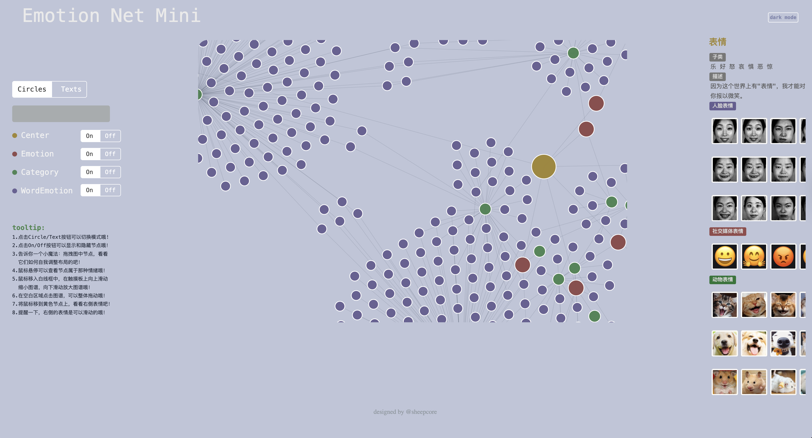
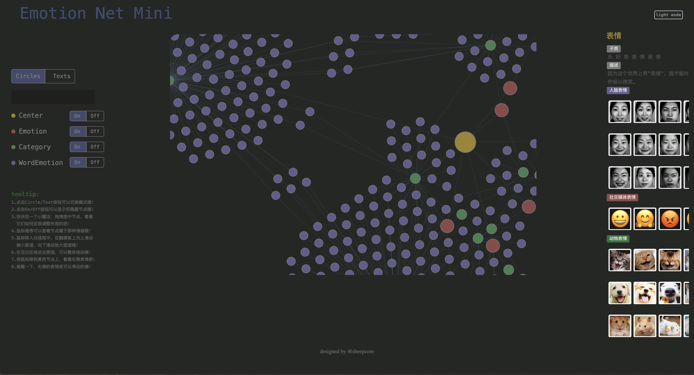

# 🌟 Emotion Net - Multimodal Emotion Knowledge Graph

> **Building an Emotional Knowledge Graph for Enhanced Sentiment Analysis**

A comprehensive web-based visualization platform for exploring multimodal emotion knowledge graphs, integrating text emotion words, facial expressions, social media emojis, and animal expressions.

## 🌐 Live Demo

**[Visit the Live Website →](https://CoreSheep.github.io/emotion-net/)**

## 📺 Demo Video

<div>
    <a href="https://www.loom.com/share/d5dcc77efbca43168d5e6a92c41a2ce8">
      <p>Building an Emotional Knowledge Graph for Enhanced Sentiment Analysis 🌟 - Watch Video</p>
    </a>
    <a href="https://www.loom.com/share/d5dcc77efbca43168d5e6a92c41a2ce8">
      
    </a>
  </div>

## 📋 Project Overview

**Emotion Net** is an interactive web application that visualizes a multimodal emotion knowledge graph, connecting sentiment words, facial expressions, and emoticons through a dynamic network representation. This project was developed as part of a Bachelor's thesis on **"Construction of a Multimodal Knowledge Graph for Fine-Grained Sentiment Analysis"** at Northeastern University (NEU), China.

### Key Features

- 🎨 **Interactive Visualization**: Drag-and-drop nodes, zoom, and pan capabilities
- 🌓 **Light/Dark Mode**: Toggle between light and dark themes
- 🔍 **Multi-Modal Display**: View relationships between text emotions, facial expressions, emojis, and animal expressions
- 📊 **Dynamic Layout**: Force-directed graph layout with automatic adjustments
- 🎯 **Node Filtering**: Show/hide different node types (Center, Emotion, Category, WordEmotion)
- 📱 **Responsive Design**: Clean, modern UI built with Bootstrap

## 🏆 Academic Recognition

**China Invention Patent (Granted)**
- **Title**: Method for Constructing and Presenting a Multimodal Sentiment Knowledge Graph
- **Patent Number**: CN ZL202011319237.8
- **Grant Date**: September 7, 2021
- **Status**: Co-inventor

## 🎨 Screenshots

### Light Mode


### Dark Mode


## 📊 Datasets

The project integrates four types of multimodal emotional datasets:

### 1. Text Emotion Word Dataset
- **Source**: Open-source text emotion word dataset from Dalian University of Technology
- **Size**: 27,466 emotion words
- **Attributes**: Part of speech, word meaning, emotion classification, intensity, and polarity
- **Categories**: 9 categories of Chinese text emotion attributes
- **Distribution**: Evenly distributed across major emotion categories

### 2. Facial Expression Image Dataset
- **Source**: JAFFE (Japanese Female Facial Expression) dataset
- **Size**: 216 facial expression images
- **Subjects**: 10 Japanese female students
- **Expressions**: 7 types of facial expressions
  - Angry
  - Disgust
  - Fear
  - Happy
  - Sad
  - Surprise
  - Neutral

### 3. Animal Expression Dataset
- **Source**: Self-collected and organized by the authors
- **Size**: 84 images
- **Animals**: Three types of animals
  - Cat
  - Dog
  - Hamster
- **Categories**: 7 major categories of emotions

### 4. Social Media Emoji Dataset
- **Source**: Open-source emoji website [emojipedia.org](https://emojipedia.org/)
- **Size**: 77 emoji images
- **Categories**: 7 major categories of emotional expressions
- **Collection**: Collected and organized specifically for the emotion modality of social media emojis

## 🛠️ Technology Stack

### Frontend
- **HTML5** / **CSS3** / **JavaScript**
- **Bootstrap** - Responsive UI framework
- **jQuery** - DOM manipulation and event handling
- **D3.js** - Data visualization and force-directed graph layout

### Backend & Data Storage
- **Neo4j** - Graph database for storing the textual emotional knowledge graph
- **Protégé** - Open-source ontology editor for knowledge graph construction

### Deep Learning (Optimization Phase)
- **CNN (Convolutional Neural Network)** - Facial expression recognition model
- Used for incremental expansion and optimization of the graph
- Applied for augmenting facial expression image datasets

## 📁 Project Structure

```
emotion-net/
├── assets/
│   ├── graph/              # Knowledge graph data files
│   │   ├── emotion-net.json
│   │   ├── label-info.json
│   │   ├── links/          # Relationship data
│   │   └── nodes/          # Node data
│   ├── images/             # Multimodal emotion images
│   │   ├── human-face-emotions/
│   │   ├── animal-cat-emotions/
│   │   ├── animal-dog-emotions/
│   │   ├── animal-hamster-emotions/
│   │   └── social-media-emotions/
│   └── mini-graph/         # Mini graph data
├── css/                    # Stylesheets
├── js/                     # JavaScript libraries
├── img/                    # Project screenshots
├── index.html             # Main application file
└── README.md              # This file
```

## 🎮 Usage Guide

### Interactive Features

1. **Switch Display Modes**: Click "Circles" or "Texts" to toggle between node visualization modes
2. **Toggle Node Types**: Use the On/Off switches to show/hide different node categories:
   - Center
   - Emotion
   - Category
   - WordEmotion
3. **Drag Nodes**: Click and drag any node to see how the graph adjusts its layout dynamically
4. **Hover for Details**: Move your mouse over a node to see which emotion it belongs to
5. **Zoom**: Move your mouse into the graph area and scroll up/down to zoom in/out
6. **Pan**: Click on an empty area of the graph and drag to move the entire graph
7. **View Expressions**: Hover over the yellow node to see related expressions displayed on the right sidebar
8. **Scroll Expressions**: The expression images on the right side are scrollable

### Dark Mode

Click the "dark mode" button in the top right corner to toggle between light and dark themes.

## 🔬 Research Methodology

### Phase 1: Knowledge Graph Construction
- **Approach**: Top-down methodology using Protégé ontology editor
- **Operations**: Entity extraction and relationship extraction from collected multimodal emotions
- **Storage**: Neo4j graph database for textual emotional knowledge graph

### Phase 2: Web Visualization Development
- **Purpose**: Build "Emotion Net" web page for illustrating the multimodal emotion knowledge graph
- **Features**: Interactive functions including dragging, zooming, and automatic/dynamic layout adjustments

### Phase 3: Incremental Expansion & Optimization
- **Technology**: Deep learning technologies (CNN-based facial expression recognition)
- **Process**: Model training, loss function selection, and parameter optimization
- **Application**: Successful deployment for augmenting facial expression image datasets

## 📝 Applications

The multimodal emotion knowledge graph can be applied in:
- **Multimodal Sentiment Analysis**: Analyzing emotions across different modalities
- **Face Recognition**: Enhancing facial expression recognition systems
- **Micro Expression Discrimination**: Identifying subtle emotional expressions
- **Human-Computer Sentiment Interaction**: Improving emotion-aware interfaces

## 👥 Authors

- **@sheepcore** - Project Designer & Developer

## 📄 License

This project is part of academic research. Please refer to the patent documentation for usage rights.

## 🙏 Acknowledgments

- Dalian University of Technology for providing the text emotion word dataset
- JAFFE dataset contributors
- Emojipedia.org for emoji resources
- D3.js community for excellent visualization tools

## 📧 Contact

For questions or collaborations, please open an issue in the repository.

---

**Note**: This project represents work completed as part of a Bachelor's thesis at Northeastern University (NEU), China, and includes patented methodology for constructing and presenting multimodal sentiment knowledge graphs.

