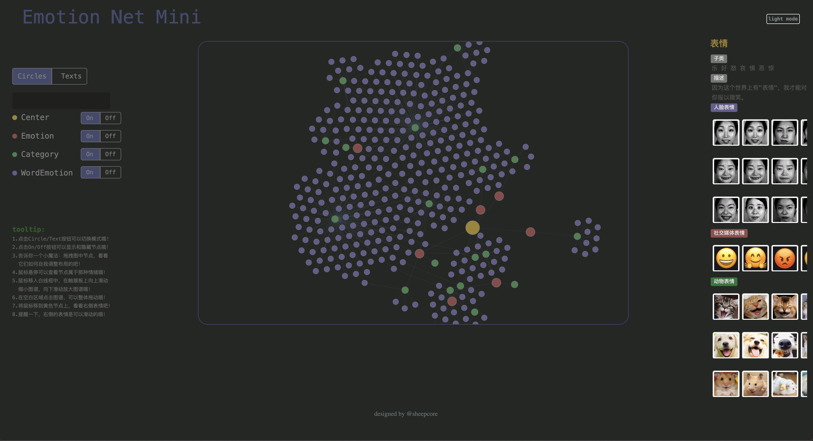
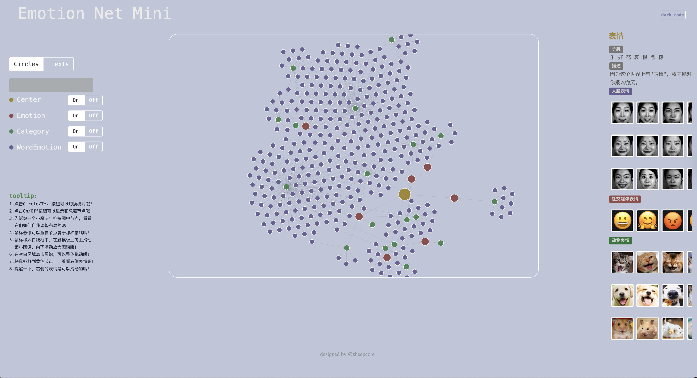

# 🌟 Emotion Net - Multimodal Emotion Knowledge Graph

An interactive web-based visualization platform for exploring multimodal emotion knowledge graphs, connecting sentiment words, facial expressions, social media emojis, and animal expressions.

## 📺 Demo Video

<div align="center">
    <a href="https://www.loom.com/share/d5dcc77efbca43168d5e6a92c41a2ce8">
      <p>Building an Emotional Knowledge Graph for Enhanced Sentiment Analysis 🌟 - Watch Video</p>
    </a>
    <a href="https://www.loom.com/share/d5dcc77efbca43168d5e6a92c41a2ce8">
      
    </a>
</div>

## 🌐 Live Demo

**[Visit the Live Website →](https://coresheep.github.io/emotion-net/)**

## 🎨 Interface


*Interactive knowledge graph visualization with dark mode*


*Interactive knowledge graph visualization with light mode*

## ✨ Features

- **🖱️ Drag & Drop**: Click and drag any node to reposition it - watch the graph dynamically adjust its layout
- **🔍 Zoom Control**: Scroll to zoom in and out of the graph for detailed exploration
- **👆 Hover to Explore**: Move your mouse over nodes to see which emotion category they belong to
- **🔗 Click to Connect**: Click on any node to highlight its direct connections and relationships
- **🎭 Expression Images**: View emotion representations across three modalities:
  - 😊 **Human Face Expressions** - Real facial emotion images
  - 😃 **Social Media Emojis** - Digital emotion representations
  - 🐱 **Animal Expressions** - Emotion expressions from cats, dogs, and hamsters
- **🌓 Dark/Light Mode**: Toggle between dark and light themes for comfortable viewing

## 📊 Dataset

The knowledge graph integrates multimodal emotional data representing **7 core emotions**:

<div align="center">

| Emotion | English | Description |
|:-------:|:-------:|:------------|
| 乐 | Joy | Happiness, pleasure, delight |
| 好 | Good | Positive feelings, satisfaction |
| 怒 | Anger | Frustration, rage, irritation |
| 哀 | Sadness | Sorrow, grief, melancholy |
| 惧 | Fear | Anxiety, worry, terror |
| 恶 | Disgust | Aversion, revulsion, dislike |
| 惊 | Surprise | Astonishment, amazement, shock |

</div>

**Dataset Sources:**
- **Text Emotion Words**: 27,466 Chinese emotion words from Dalian University of Technology
- **Facial Expressions**: JAFFE dataset with 216 images across 7 emotions
- **Animal Expressions**: 84 images (cats, dogs, hamsters) collected and curated
- **Social Media Emojis**: 77 emoji images from emojipedia.org

## 🏆 Academic Recognition

**Bachelor's Thesis**
- **Topic**: "Construction of a Multimodal Knowledge Graph for Fine-Grained Sentiment Analysis" ([view the project website](https://coresheep.github.io/emotion-net/))
- **Institution**: Northeastern University (NEU), China

**China Invention Patent (Granted)**
- **Title**: Method for Constructing and Presenting a Multimodal Sentiment Knowledge Graph
- **Patent Number**: CN ZL202011319237.8
- **Grant Date**: September 7, 2021
- **Status**: Co-inventor

## 🛠️ Technology Stack

- **Frontend**: HTML5, CSS3, JavaScript
- **Visualization**: D3.js force-directed graph
- **UI Framework**: Bootstrap
- **Data Storage**: Neo4j graph database
- **Ontology Editor**: Protégé

## 📖 Citation

If you use this work in your research, please cite:

```bibtex
@mastersthesis{li2021emotionnet,
  title={Construction of a Multimodal Knowledge Graph for Fine-Grained Sentiment Analysis},
  author={Li, Jiufeng},
  year={2020},
  school={Northeastern University},
  address={Shenyang, China},
  type={Bachelor's Thesis}
}
```

**Patent Citation:**
```
Li, J. et al. (2021). Method for Constructing and Presenting a Multimodal Sentiment Knowledge Graph. 
China Patent No. CN ZL202011319237.8.
```

---

*This project represents academic research on multimodal sentiment analysis and knowledge graph construction.*
